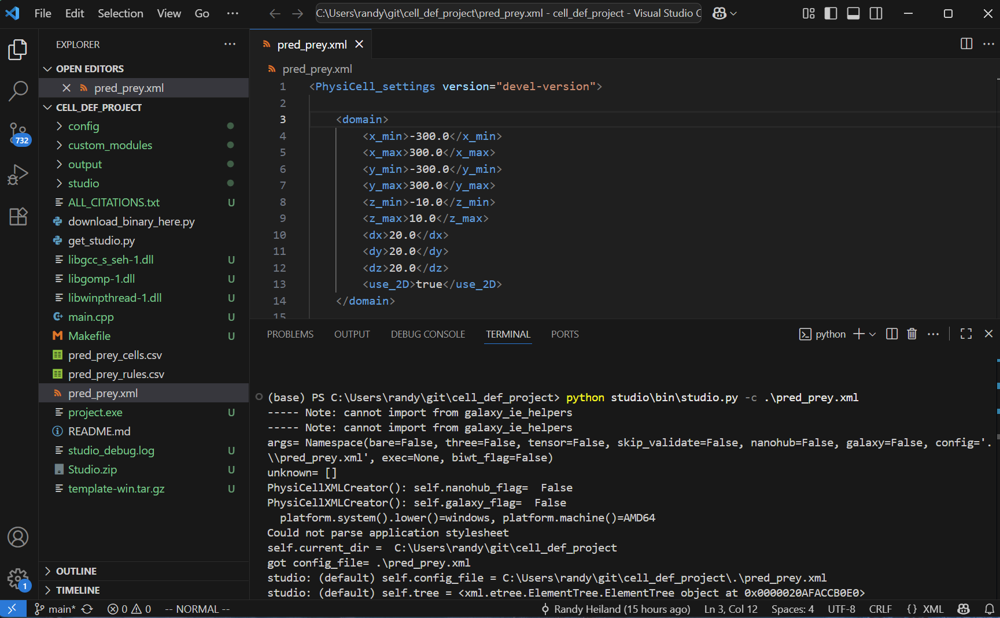
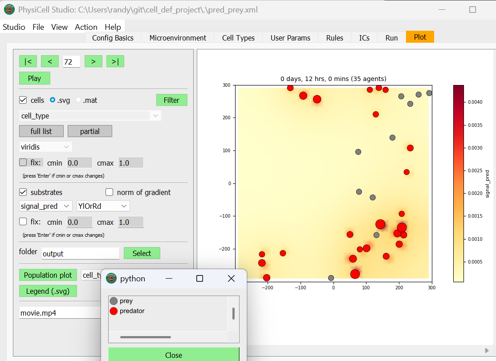
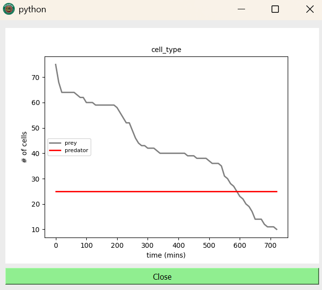
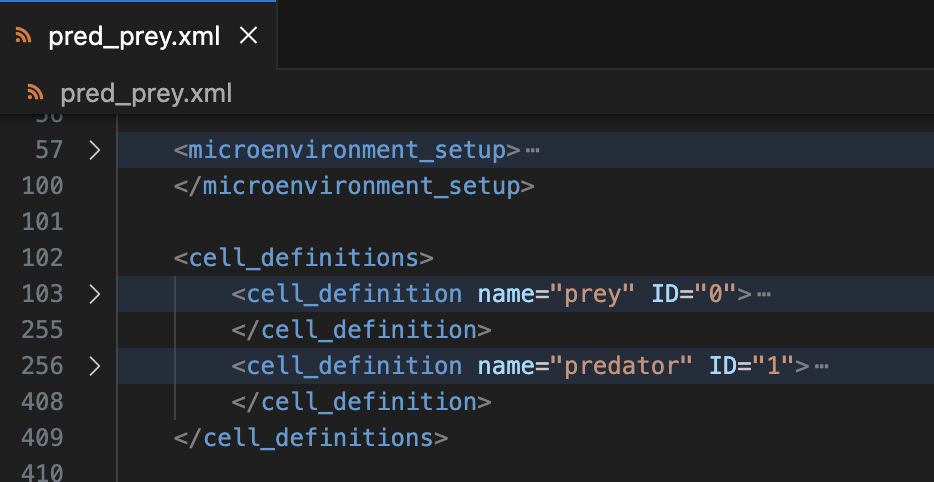

# cell_def_project

This student-led project will explore the concept of Cell Definitions for PhysiCell and how they might evolve.

To get started, clone this repo. In your VSCode, use `File -> Open folder` to open the directory where you cloned it.  Then in your VSCode Terminal, try running these 3 commands (we are assuming you're on Windows):
```
(base) PS C:\Users\randy\git\cell_def_project> python .\get_studio.py
...
(base) PS C:\Users\randy\git\cell_def_project> python .\download_binary_here.py template

(base) PS C:\Users\randy\git\cell_def_project> python .\studio\bin\studio.py -c .\pred_prey.xml
```


If it all runs correctly, you should be able to click on the "Run" tab of the Studio and click "Run Simulation" (should just take a few secs to complete). Then in the "Plot" tab, click the "Play" button to play the simulation results. And click the "Population plot" (lower-left) to see how the population of both the predator and prey cells change over time.




We will start by taking a closer look at the XML, specifically the `<cell_definition ...` contents of the model and see how those parameters map into the Studio.


